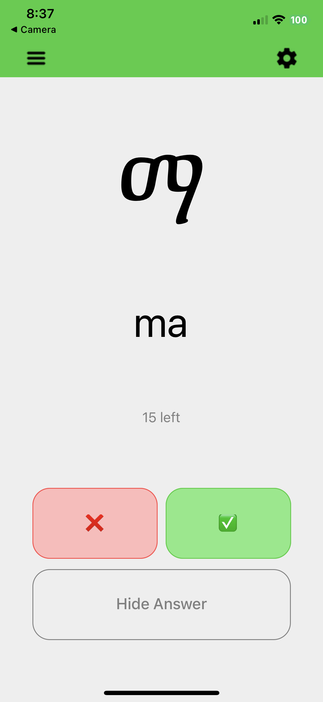

# Amharic Letters Flashcards

[Amharic](https://en.wikipedia.org/wiki/Amharic), the official language of Ethiopia, has a writing system with over 200 letters derived from beautiful Ge'ez script.

This simple app aims to provide practice learning these letters. (As of July 2022, it is aimed at English speakers only.)



# Project Status

The project is in active development as of July 2022. The hope is to release versions to various app stores sometime within 2022.

# Development

This project is built using [React Native](https://reactnative.dev/), the wonderful technology that allows you to create native apps for Android and iOS using React, a JavaScript user interface library.

## Getting Started

### Preqrequisites / Downloads

You will need:

- `expo-cli` on your local machine (`brew install expo-cli` should work on MacOS)
- [recommended] a smartphone with the [Expo Go](https://expo.dev/client) app installed

### Setup

After cloning this repo, simply yarn-install and then start the local server:

```sh
yarn
yarn start
```

You should then see a QR code with some instructions on how see the local server on your smartphone, like this:

```sh
Opening developer tools in the browser...
Starting Metro Bundler
▄▄▄▄▄▄▄▄▄▄▄▄▄▄▄▄▄▄▄▄▄▄▄▄▄▄▄
█ ▄▄▄▄▄ █ ██▀▀▄▀▄▀█ ▄▄▄▄▄ █
█ █   █ █  ▀█ ▀▄▀██ █   █ █
█ █▄▄▄█ █▀  █▄█▀▄██ █▄▄▄█ █
█▄▄▄▄▄▄▄█▄█ ▀▄█▄█▄█▄▄▄▄▄▄▄█
█▄ █▀▄▄▄▀▀█▄█▄▀▄ ███ ▀▄▄ ▄█
███▄   ▄▀▀ ▄█▀█▀ ▀▀ █▄  ▀██
█ █ █ █▄▄ ▀▀▄▀█▄▀▄▀▄▀▀▄ ▀██
███▄█ ▀▄▀  ▀ ▄█▀▄▄▄█▄▀ ▀███
█▄▄▄▄██▄█▀▄ █▄▀▄▄ ▄▄▄ ▀ ▄▄█
█ ▄▄▄▄▄ █▀  █▀██▀ █▄█ ▀▀▀██
█ █   █ █▄▄ ▄ ▀▄█▄▄ ▄▄▀ ▀▀█
█ █▄▄▄█ █▀▀▄ ███▄██▄▀█▀▀ ██
█▄▄▄▄▄▄▄█▄▄▄███▄████▄▄▄▄▄▄█

› Metro waiting on exp://192.168.1.73:19000
› Scan the QR code above with Expo Go (Android) or the Camera app
(iOS)

› Press a │ open Android
› Press i │ open iOS simulator
› Press w │ open web

› Press r │ reload app
› Press m │ toggle menu
› Press d │ show developer tools
› shift+d │ toggle auto opening developer tools on startup (enabled)

› Press ? │ show all commands

Logs for your project will appear below. Press Ctrl+C to exit.
Started Metro Bundler
```
